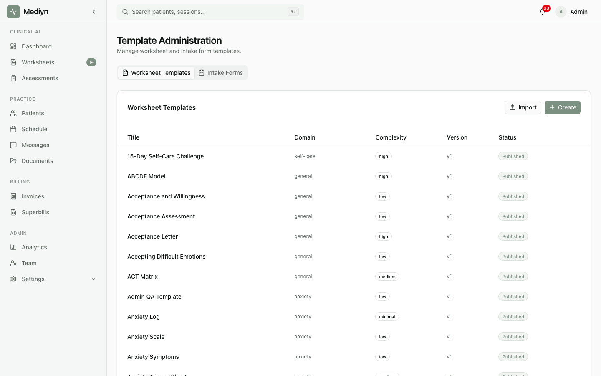

# How to Manage Templates

Mediyn lets clinic administrators govern worksheet templates used across your practice to ensure consistency and quality.

## What Are Templates?

Templates are predefined structures for clinical worksheets. They ensure that therapists across your practice use standardized formats for session documentation, treatment plans, and patient exercises.

## Viewing Available Templates

1. Go to **Settings** in Mediyn.
2. Select **Templates** or **Worksheet Templates**.
3. You will see a list of all templates available in your practice.

## Importing Templates

If you need to bring in templates from an external source:

1. Go to the **Templates** section.
2. Select **Import Template**.
3. Follow the prompts to upload or select the template.
4. Review the template details before confirming.

## Promoting Templates

Promoting a template makes it available to all therapists in your practice.

1. Go to the **Templates** section.
2. Find the template you want to promote.
3. Select **Promote** to make it available practice-wide.

## What to Expect

After promoting a template, all therapists in your practice can use it for their sessions. This ensures a consistent clinical workflow across your team.

## Good to Know

- Only clinic administrators can import and promote templates.
- Therapists can use promoted templates but cannot change the template structure.
- Review templates carefully before promoting them. Once promoted, they become available to your entire team.
- Standardized templates improve documentation quality and make it easier to review clinical records across your practice.
- Keep your template library organized. Remove or archive templates that are no longer in use.
