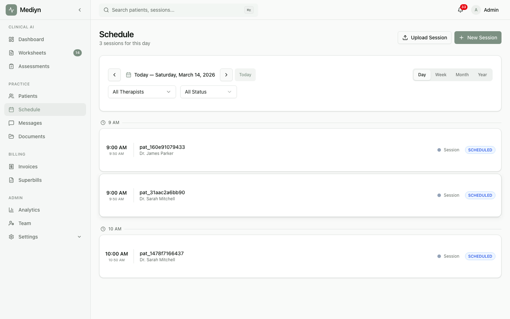

# How to Schedule a Session

Create a new session for a patient with a specific date, time, and therapist.

## Steps

1. Open the scheduling area in Mediyn.
2. Select the option to create a new session.

**You'll need to provide:**

- Patient
- Therapist
- Start date and time
- End date and time
- Session type: choose from the available choices:
  - **Individual** -- A one-on-one session
  - **Group** -- A session with multiple participants
  - **Telehealth** -- A remote session conducted online

**You can also:**

- Link the session to a specific session type from your catalog
- Connect it to a recurring schedule
- Apply a prepaid session package

3. Confirm and save the session.

## What to Expect

Mediyn checks for scheduling conflicts before creating the session. If the therapist already has a session at that time, you will be alerted.

The new session starts in the **Scheduled** status. Mediyn also tracks:

- The consent status for the session (Pending, Confirmed, Obtained, or Revoked)
- Any linked assessments, invoices, or packages

The therapist must be assigned to the patient. Therapists can only schedule sessions for their own assigned patients.

## Good to Know

- Both therapists and clinic administrators can create sessions.
- The session type you select determines the expected duration and rate.
- You can schedule sessions in advance and they will appear on the therapist's daily queue.
- If you need to change the time later, use the reschedule feature instead of creating a new session.
