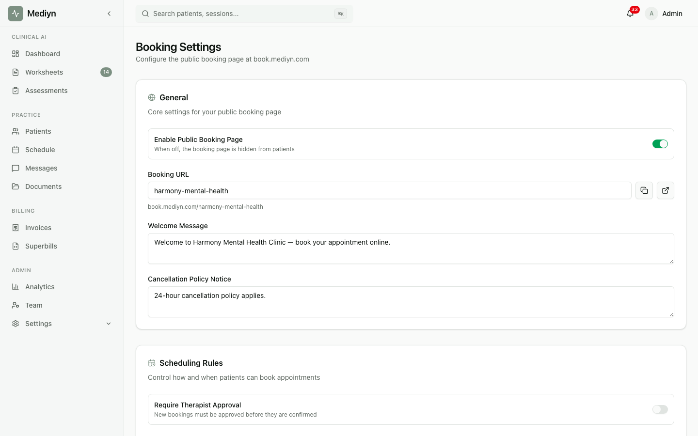

# How to Use Online Booking

Let patients book sessions directly from your public booking page.

## Steps

### Setting up your booking page

1. Go to your practice settings in Mediyn.
2. Navigate to the booking configuration.
3. Configure your booking preferences:

**You can set:**

- **Booking page address** -- A custom name for your public booking page
- **Enable or disable booking** -- Turn online booking on or off
- **Require approval** -- Choose whether booking requests need your approval or are auto-confirmed
- **Payment mode** -- Choose from:
  - **No payment** -- Patients book without paying
  - **Full payment** -- Patients pay the full session fee at booking
  - **Partial payment** -- Patients pay a percentage at booking
- **Partial payment percentage** -- The percentage to charge upfront (if using partial payment)
- **Auto-charge timing** -- How many days before the session to charge the remaining balance
- **Buffer time** -- Minutes between sessions to prevent back-to-back bookings
- **Advance booking window** -- How far in advance patients can book (in days)
- **Minimum notice** -- How many hours before a slot patients must book (prevents last-minute bookings)
- **Allow new patients** -- Whether new patients can book through your page
- **Send intake forms on booking** -- Automatically send intake packets when a booking is confirmed
- **Cancellation policy notice** -- Text displayed to patients about your cancellation rules
- **Booking confirmation message** -- A custom message shown after booking
- **Default session type** -- The pre-selected session type on your booking page
- **Allowed session types** -- Which session types patients can choose from

4. Save your settings.

### Setting up therapist booking profiles

Each therapist can have a public profile that appears on your booking page.

**Therapists can set:**

- A booking page address for their personal page
- A public bio
- A profile photo
- Whether they are accepting new patients

### How patients book online

1. The patient visits your public booking page.
2. They see your practice information, available therapists, session types, and any session packages.
3. They select a therapist and view available time slots for a date range (up to 14 days).
4. They choose a time slot and session type.
5. They provide their information (or sign in if they are a returning patient).
6. They complete payment if required.
7. They can also add notes for the therapist.
8. They submit the booking request.

### Managing booking requests

Depending on your settings, bookings are either auto-confirmed or require your approval.

1. View pending booking requests in Mediyn.
2. You can narrow the list by status or therapist.

Booking requests move through these stages:

- **Pending** -- Waiting for your review
- **Confirmed** -- Approved and session is created
- **Declined** -- You chose not to accept the request
- **Cancelled** -- The patient or an administrator canceled the request
- **Expired** -- The request was not acted on in time

**To confirm a booking request:**

1. Open the request.
2. Optionally select a session type.
3. Choose whether to send intake forms automatically.
4. Confirm the booking.

Mediyn creates the session and processes any pending payment.

**To decline a booking request:**

1. Open the request.
2. Provide a reason (optional).
3. Decline the request.

**To cancel a booking request:**

1. Open the request.
2. Cancel it.

### Session packages

You can offer prepaid session packages on your booking page.

**To create a package:**

1. Go to your package settings.
2. Create a new package template.

**You'll need to provide:**

- Session type
- Package name
- Number of sessions included
- Total price
- Description

You can also edit or archive packages as needed.

Patients can purchase packages directly from your booking page. When a patient buys a package, Mediyn tracks the total sessions and remaining sessions.

### Downloading a calendar invite

After a booking is confirmed, the patient can download a calendar file to add the session to their personal calendar.

## What to Expect

Once online booking is enabled, your public page is accessible to anyone with the link. Patients can browse your therapists, view availability, and submit booking requests.

Available time slots are calculated based on each therapist's availability templates, existing sessions, pending requests, buffer time, and your booking policies.

## Good to Know

- You must set availability templates for each therapist before their slots appear online.
- Patients can only book up to 14 days of slots at a time.
- If you require approval, booking requests stay in "Pending" until you confirm or decline them.
- Returning patients can sign in to avoid re-entering their details.
- Payment is handled securely at the time of booking. Patients can use a saved payment method or provide a new one.
- Auto-charge timing works with deferred payments. The remaining balance is charged automatically before the session.
