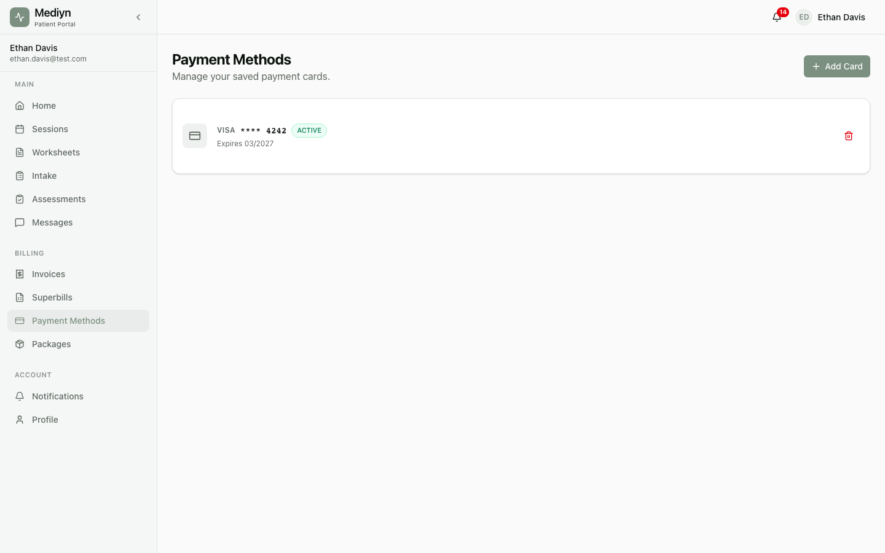

# How to Manage Payment Methods

Mediyn lets you save payment methods for your patients so you can collect session fees quickly and securely.

## Adding a Payment Method

1. Open the patient's profile in Mediyn.
2. Go to the **Payment Methods** section.
3. Select **Add Payment Method**.
4. Mediyn will open a secure form where the patient can enter their card details.
5. Once the card is verified, it will be saved to the patient's profile.

## What to Expect

After adding a payment method, Mediyn creates a payment profile for the patient. This profile securely stores the card details so you can charge future sessions without re-entering the information.

## Viewing Saved Payment Methods

1. Open the patient's profile.
2. Go to the **Payment Methods** section.
3. You will see a list of all saved payment methods for that patient.

## Removing a Payment Method

1. Open the patient's profile.
2. Go to the **Payment Methods** section.
3. Find the payment method you want to remove.
4. Select **Remove** next to the payment method.
5. Confirm the removal.

The payment method will be permanently disconnected from the patient's profile.

## Good to Know

- Each patient can have multiple payment methods on file.
- Removing a payment method does not affect past invoices that were already paid with that method.
- Payment details are handled securely. Mediyn never stores raw card numbers directly.
- If a patient's card expires or is declined, you will need to add a new payment method.
