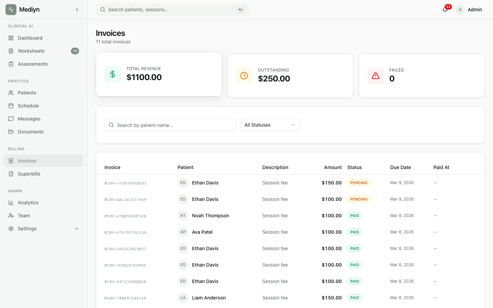

# Billing & Payments

Mediyn helps you manage invoices, collect payments, and keep your billing organized in one place.

## What You Can Do

- View your current plan and subscription details
- Create and manage invoices for sessions
- Collect payments from patients securely
- Set up payment profiles for patients
- Download invoice PDFs for your records
- Configure automatic billing preferences

## Key Concepts

**Plan** — Your Mediyn subscription tier. Plans come in two modes:
- **Clinic** — Designed for multi-therapist practices with per-seat pricing
- **Therapist** — Designed for solo practitioners

**Subscription** — Your active plan enrollment. Your subscription moves through these stages:
- **Setup in progress** — You have signed up but have not completed the payment setup yet
- **Trial** — You are using Mediyn during your free trial period
- **Active** — Your subscription is fully active and payments are current
- **Past due** — A recent payment did not go through successfully
- **Canceled** — Your subscription has been canceled
- **Expired** — Your subscription period has ended

**Invoice** — A billing record for a session or service. Each invoice has a sequential number (for example, INV-2026-0001).

**Payment profile** — A saved payment method linked to a patient for easy recurring charges.

**Billing interval** — How often you are billed. Available choices:
- Monthly
- Yearly
