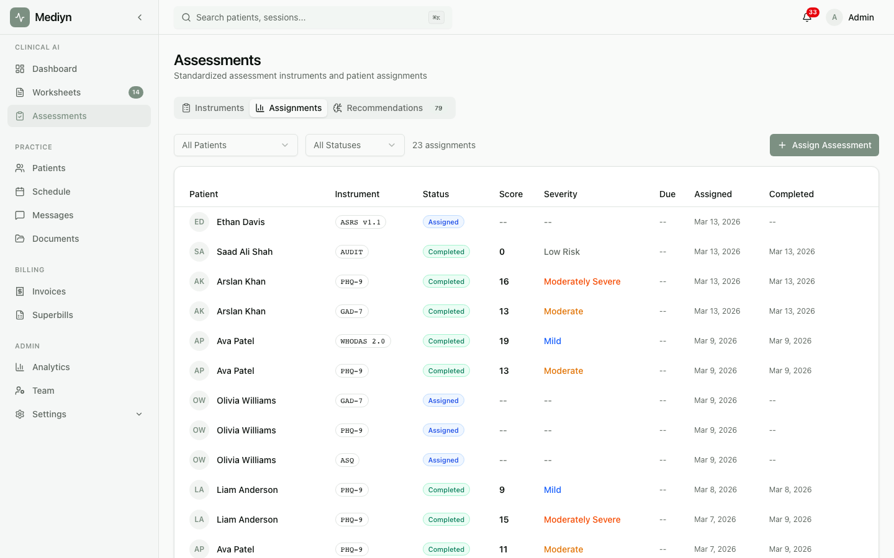

# How to Set Up Recurring Assessments

Mediyn can automatically schedule assessments at regular intervals so you can track patient progress over time without manual effort.

## Creating a Recurring Schedule

1. Open the patient's profile.
2. Choose **Set Up Recurring Assessment**.

You'll need to provide:
- **Instrument** -- The screening tool to use (e.g., PHQ-9, GAD-7)
- **Frequency** -- How often to administer, in days (e.g., every 14 days)
- **Start date** -- When the first assessment should be assigned

### What to Expect

- Mediyn creates the schedule and shows you the next due date.
- New assessment assignments are created automatically at each interval.
- The schedule starts in the **Active** stage.

## Viewing Existing Schedules

- Open the patient's profile and look for their assessment schedules.
- You see all active, paused, and cancelled schedules for that patient.

## Updating a Schedule

1. Open the schedule you want to change.
2. Edit the settings.

You can change:
- **Frequency** -- Adjust how often the assessment is administered
- **Next due date** -- Move the next scheduled assessment forward or back
- **Status** -- Pause or cancel the schedule

### Schedule Status Choices

- **Active** -- Assessments are being created on schedule
- **Paused** -- The schedule is on hold. No new assessments are created until you resume.
- **Cancelled** -- The schedule is permanently stopped

### What to Expect

- Changes take effect immediately.
- Pausing a schedule preserves all previous assessment data. You can resume at any time by setting the status back to active.
- Cancelling a schedule does not remove past assessments. Historical data is always preserved.

## Good to Know

- Recurring schedules are great for tracking treatment progress with standardized measures over weeks or months.
- You can set up multiple recurring schedules for the same patient using different instruments.
- If a patient misses a scheduled assessment (it expires), the next one is still created on schedule.
- Combine recurring assessments with severity alerts to get notified when scores cross a concerning threshold.
