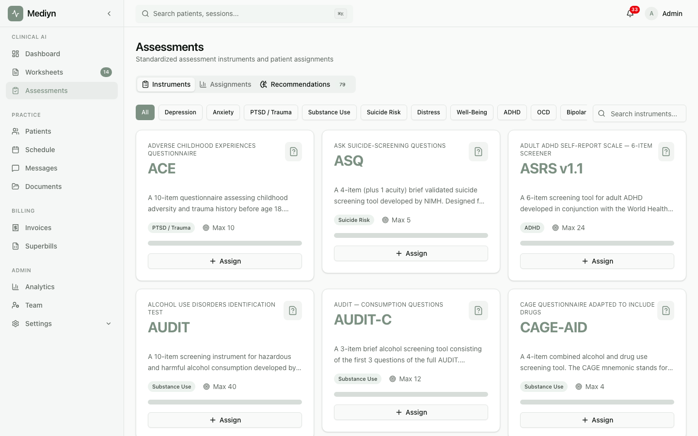

# Clinical Assessments & Screeners

Mediyn provides standardized clinical screening tools with automatic scoring, recurring schedules, and progress tracking over time.

## What You Can Do

- Choose from a library of validated instruments (PHQ-9, GAD-7, and more)
- Get smart recommendations for which assessments to administer based on session context
- Create one-time or recurring assessment schedules for your patients
- Have patients complete screeners directly in Mediyn
- View auto-scored results with severity levels and score interpretation
- Track patient progress over time with trend analysis
- Set up severity threshold alerts to stay informed about critical changes
- Review aggregate clinical outcomes across your practice

## Key Concepts

- **Instrument**: A validated clinical screening tool (such as PHQ-9 for depression or GAD-7 for anxiety). Each instrument has a set of questions, a scoring method, and defined severity ranges.
- **Assessment Assignment**: A specific instance of an instrument given to a patient. It can be a one-time screener or part of a recurring schedule.
- **Auto-Scoring**: When a patient submits their answers, Mediyn automatically calculates the total score, severity level, and any subscale scores.
- **Recurring Schedule**: An automated plan that creates new assessment assignments at regular intervals (for example, every 14 days).
- **Severity Alert**: A notification triggered when a patient's score crosses a threshold you have defined.
- **Progress Tracking**: A view of a patient's scores over time for a specific instrument, including trend analysis.

## Available Clinical Domains

You can find instruments for these areas:

- Depression
- Anxiety
- Trauma
- Suicide risk
- Substance use
- ADHD
- Functional impairment
- OCD
- Bipolar
- Pediatric
- Multi-domain (covers more than one area)

## Assessment Stages

Each assessment assignment moves through these stages:

1. **Assigned** -- The patient has received the assessment
2. **In Progress** -- The patient has started answering questions
3. **Completed** -- The patient has submitted all answers and scores are available
4. **Expired** -- The assessment was not completed before its due date
