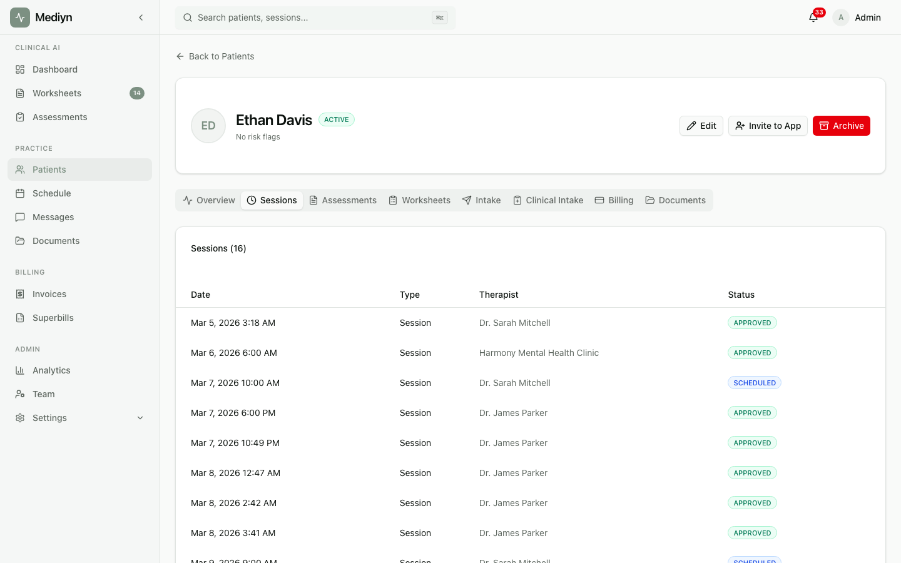

# Clinical Notes & Review

Mediyn generates clinical documentation from your session recordings and gives you full control to review, edit, and approve the final notes.

## What You Can Do

- View the transcription, summary, and key insights for each session
- Edit any clinical note before approving it
- Review the version history of each note to see previous edits
- Approve finalized notes to complete the session

## Key Concepts

**Clinical Artifacts**
The documents Mediyn produces for each session. There are three types:

- **Transcription** -- A text record of what was said during the session
- **Summary** -- A condensed overview of the session content
- **Key Insights** -- Notable observations, including clinical insights, red flags, and suggested follow-up questions

**Artifact Source**
Each artifact shows where it came from:

- **On-device** -- Generated locally on your device before submission
- **Server** -- Generated by Mediyn after you submitted the transcript

**Artifact State**
Each artifact has a status that shows where it is in the review process:

- **In Review** -- The note is ready for you to review and edit
- **Approved** -- You have finalized the note

**Version History**
Every time you edit an artifact, Mediyn saves the previous version. You can view the full history of changes at any time. This provides a complete record for your files.
