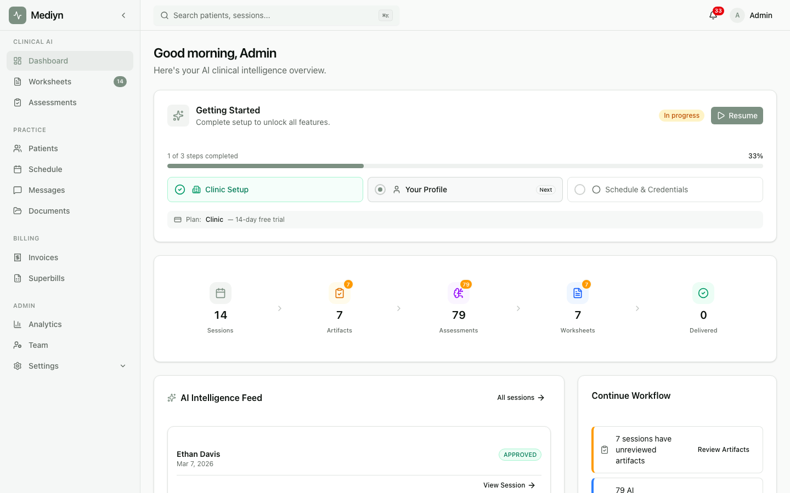

# How to Use the Dashboard

Your dashboard is the first thing you see when you open Mediyn. It summarizes your workday at a glance.

## Steps

1. Open Mediyn. Your dashboard loads automatically.
2. Review the summary counters at the top of the screen. Each counter shows one category of pending work.
3. Click any counter to jump directly to that section.

## What You'll See

Your dashboard displays these counters:

- **Today's sessions** — The number of sessions scheduled for today.
- **Pending artifact reviews** — Documents or session artifacts waiting for your review.
- **Pending worksheet approvals** — Worksheets your patients have submitted and you need to approve.
- **Pending worksheet responses** — Worksheet assignments patients have submitted and are awaiting your review.
- **Pending intake packets** — Intake packets that have been sent to patients or are partially completed.
- **Pending assessments** — Assessments that are assigned to patients or currently in progress.
- **Assessment alerts** — Assessment results from the last 30 days that triggered an alert rule.
- **Unread messages** — Messages across all your conversations that you have not read yet.
- **Pending recommendations** — AI-generated assessment recommendations waiting for your action.

## What to Expect

Counters update in real time. When you complete a task, the matching counter decreases. If a patient submits a worksheet or assessment, the counter increases automatically.

## Good to Know

- The dashboard is personalized to you. You only see counters for your own patients and caseload.
- Assessment alerts cover the last 30 days. Older alerts roll off automatically.
- Use the dashboard as your daily checklist. Start with the highest counters first.
