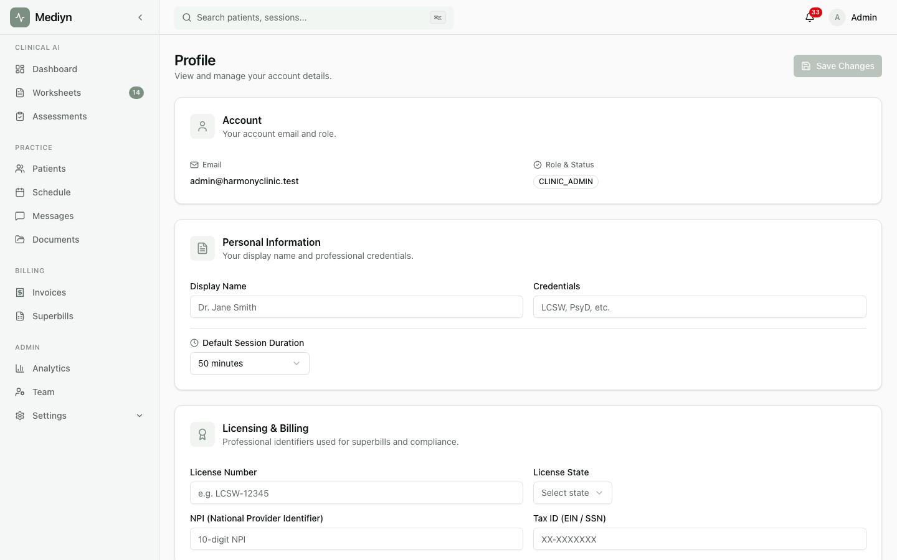

# How to Complete Therapist Onboarding

Set up your therapist profile in Mediyn so you can start managing your schedule and patients.

## Steps

1. Sign in to your Mediyn account.
2. Mediyn will launch the therapist onboarding guide.
3. You'll need to provide:
   - **First name** and **Last name**.
   - **Time zone** — Your local time zone for accurate scheduling.
4. You can also:
   - **Preferred name** — A name you go by that differs from your legal name. This is shown throughout Mediyn.
   - **Professional credentials** — Your qualifications and certifications.
   - **Session duration preference** — Your preferred appointment length in minutes.
   - **Availability templates** — Set up your recurring weekly schedule. This tells Mediyn when you are available for appointments.
5. Complete each step and move to the next.

## What to Expect

- Mediyn tracks your progress. You will see which steps are completed and what comes next.
- Your onboarding moves through these stages:
  - **Not started** — You have not begun setup yet.
  - **In progress** — You have completed some steps but not all.
  - **Complete** — All setup steps are finished and your profile is ready.
- Your current subscription plan is shown during onboarding for reference.

## Good to Know

- You can leave onboarding and return later. Mediyn saves your progress automatically.
- If you skip optional steps, you can fill in those details later from your profile settings.
- Availability templates are important for scheduling. Setting them up now saves time later.
