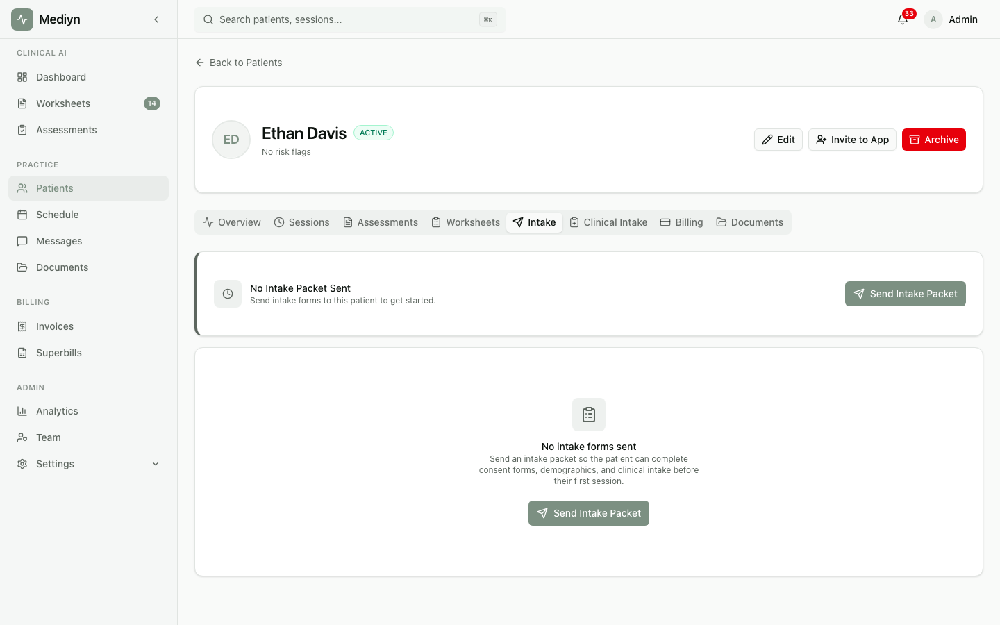

# How to Review Intake Responses

View and manage the answers your patients have submitted on their intake forms.

## Steps

1. Open the patient's profile in Mediyn.
2. Navigate to the intake responses section.
3. Review the list of completed and in-progress responses.
4. Select any response to see the full details.

## What to Expect

You will see all intake form responses for the selected patient. Each response shows:

- Which form the patient filled out
- The patient's answers to each question
- The current status (in progress or submitted)
- When the response was last updated

You can also view the overall intake packet status to see how far along the patient is with all their forms.

## Good to Know

- Patients can save partial responses and come back later. You will see those as "in progress."
- Once a patient submits a response, it cannot be changed by the patient. Contact the patient if corrections are needed.
- You can review responses for multiple packets if a patient has been sent more than one over time.
- Intake responses are available as soon as the patient submits them. You do not need to wait for the entire packet to be completed.
