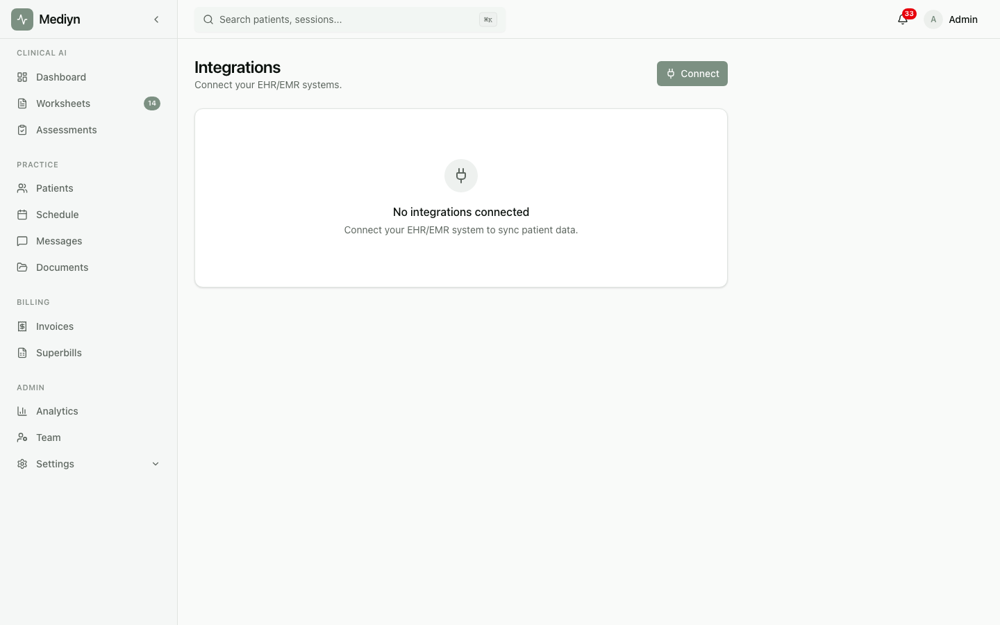

# Integrations

Mediyn connects with your existing EHR/EMR system so patient data stays in sync across platforms.

## What You Can Do

- Set up a connection between Mediyn and your EHR/EMR system
- View all active integration connections
- Check the health and status of each connection
- Monitor sync history and troubleshoot issues
- Trigger a manual sync when needed

## Key Concepts

**EHR/EMR integration** — A connection between Mediyn and your electronic health records (EHR) or electronic medical records (EMR) system. This allows data to flow between the two platforms.

**Integration type** — The standard used for the connection. Currently available:
- **FHIR** — A widely used healthcare data exchange standard

**Integration status** — Each connection has a status:
- **Active** — The connection is working normally
- **Disabled** — The connection has been turned off
- **Error** — There is a problem with the connection that needs attention

**Health status** — A real-time check on how well the integration is performing:
- **Healthy** — Everything is working as expected
- **Degraded** — The connection is working but with some issues
- **Failed** — The connection is not working and needs troubleshooting

**Sync run** — A data synchronization event where information is sent from Mediyn to your external system. Each sync run is recorded so you can review the history.
