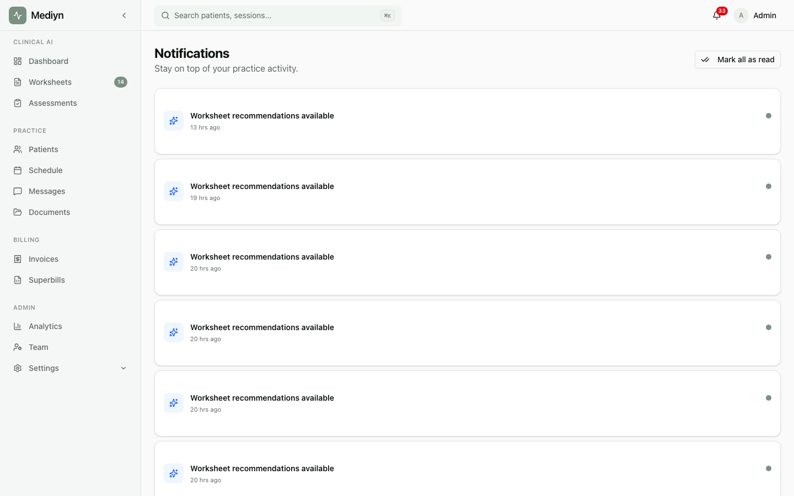

# How to Use Live Updates

Mediyn delivers real-time updates to your screen so you always have the latest information without refreshing.

## Steps

1. Simply keep Mediyn open in your browser or app. Live updates are enabled automatically.
2. Watch for real-time alerts as they appear. These may include session status changes, new messages, completed background tasks, or newly created documents.
3. Click on any live update to navigate to the related item.

## What to Expect

When something changes in your practice, Mediyn pushes an update to your screen instantly. For example:

- A patient joins a scheduled session, and the session status changes to "in progress."
- A background task like a report generation finishes, and you see a completion notice.
- A new notification is created, and your notification counter updates immediately.
- A document or artifact is created, and it appears in your feed right away.

Mediyn checks the connection every 30 seconds to keep updates flowing smoothly.

## Good to Know

- Live updates work as long as you have Mediyn open. If you close the app, updates queue up and appear when you return.
- No setup is required. Live updates are on by default for every user.
- If you notice updates have stopped arriving, try refreshing the page. This restores the connection.
- Live updates apply to your entire practice. You see changes for any patient or session you have access to.
