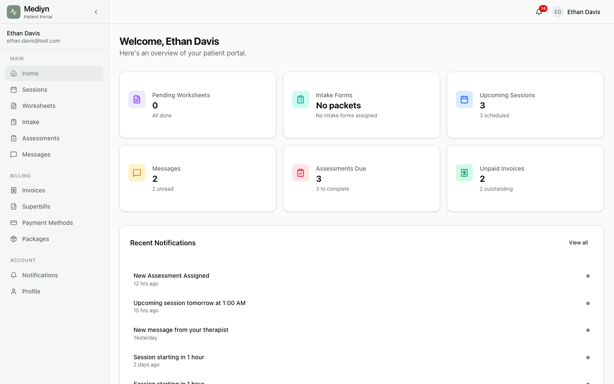

# How Patients Use the Portal

The Mediyn patient portal gives your patients a secure place to manage their care between sessions.

## Viewing Their Profile

Patients can view and update their own contact information.

- They can change their preferred name, phone number, email, date of birth, and address.
- Their legal name, consent status, and insurance details are visible but managed by the practice.

## Viewing Appointments

Patients can see their upcoming and past sessions.

- They can browse sessions by status: scheduled, in progress, completed, approved, cancelled, or no show.
- They can also look up sessions by date.
- Use the next page of results to see older sessions.

## Completing Worksheets

When you assign a worksheet to a patient, it appears in their portal.

- Patients see a list of assigned worksheets with their current status: assigned, in progress, submitted, or reviewed.
- They open a worksheet to see the questions and any context you provided.
- They can save their answers and come back later, or submit them when finished.
- Once submitted, you receive a notification and the worksheet moves to "submitted" status.

## Completing Intake Forms

Patients can fill out intake forms and sign consent documents.

- Pending intake packets and Good Faith Estimates appear in their intake section.
- They fill out each form, save progress, and submit when done.
- For consent forms, they sign using a checkbox or by drawing their signature.
- They can acknowledge a Good Faith Estimate directly in the portal.

## Taking Assessments

When you assign an assessment, the patient completes it in the portal.

- Patients see their assigned and in-progress assessments.
- They open an assessment to view the questions and answer all of them.
- All questions must be answered before submitting. Partial submissions are not accepted.
- After submitting, Mediyn scores the assessment automatically. The patient sees their total score and severity level.
- Patients can also view their assessment score history over time and see whether their trend is improving, stable, or worsening.

## Messaging Their Therapist

Patients can send and receive messages through the portal.

- They see a list of their conversations.
- They open a conversation to read messages from their therapist.
- They can send text messages and attach documents.
- Unread messages are clearly marked.

## Viewing Invoices and Making Payments

Patients can access their billing information.

- They see a list of invoices with details like amount, status, and date.
- Invoice statuses include: pending, paid, overdue, cancelled, refunded, payment failed, or voided.
- They can pay a pending invoice using their card on file.
- They can download invoice PDFs for their records.

## Managing Superbills

Patients can view and download superbills for insurance reimbursement.

- Finalized superbills appear in their superbills section.
- They can download a PDF of any superbill.

## Managing Session Packages

Patients can check the status of any session packages they have purchased.

## Managing Payment Methods

Patients can add, view, and remove their payment cards.

- They can add a new card to keep on file.
- They can view their saved cards.
- They can remove a card they no longer want to use.

## Viewing Notifications

Patients have their own notification feed.

- They can see all their notifications or filter to show only unread ones.
- They can mark notifications as read.
