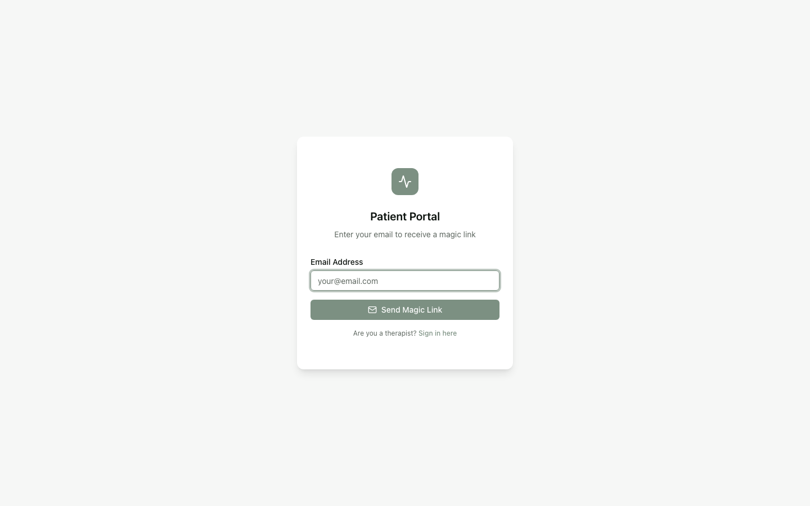

# Patient Login & Portal Access

Mediyn lets your patients sign in securely without a password using magic links and device biometrics.

## What You Can Do

- Send patients a magic link invitation to access Mediyn
- Let patients sign in using a secure email link (no password needed)
- Allow patients to set up fingerprint or face recognition for faster access
- View and manage which devices a patient has registered
- Revoke access from a specific device if needed
- Give patients access to their appointments, worksheets, assessments, messages, invoices, and more

## Key Concepts

- **Magic link** — A secure, one-time-use link sent to a patient's email. Clicking it signs them in automatically. No password required.
- **Trusted device** — A phone, tablet, or computer that a patient has used to sign in. Mediyn remembers the device for future visits.
- **Biometric sign-in** — Using fingerprint or face recognition on a mobile device to sign in instead of clicking a magic link each time.
- **Patient portal** — The patient-facing side of Mediyn where patients can view appointments, complete worksheets, take assessments, message their therapist, view invoices, and manage payment methods.
- **App access status** — Tracks where a patient is in the onboarding process. The stages are:
  - **Not invited** — The patient has not been sent an invitation yet.
  - **Invited** — An invitation has been sent but the patient has not signed in yet.
  - **Active** — The patient has signed in and can use the portal.
  - **Deactivated** — Access has been turned off for this patient.
- **Invitation status** — Tracks the state of a specific invitation:
  - **Pending** — The invitation was sent and is waiting for the patient to use it.
  - **Accepted** — The patient clicked the link and signed in.
  - **Expired** — The link has passed its expiration date and time.
  - **Revoked** — The invitation was manually canceled.
