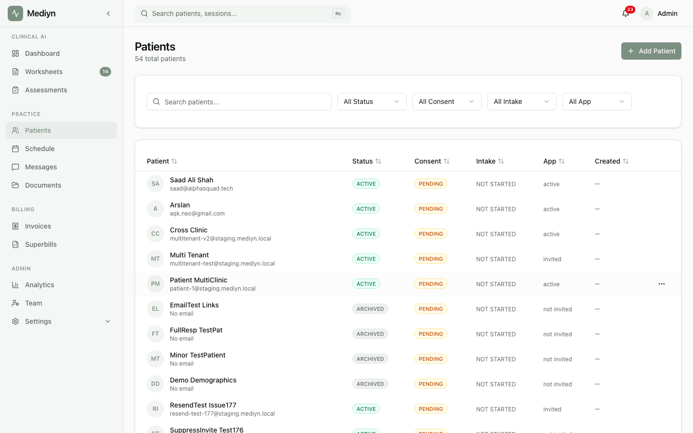

# How to Add a New Patient

Create a patient record in Mediyn to start tracking their care.

## Steps

1. Sign in to your Mediyn account.
2. Navigate to the **Patients** section.
3. Select **Add Patient** (or a similar option).
4. You'll need to provide:
   - **First name** — The patient's legal first name.
   - **Last name** — The patient's legal last name.
5. You can also:
   - **Preferred name** — A name the patient goes by. This is displayed throughout Mediyn when set.
   - **Consent status** — Set the initial consent stage:
     - **Pending** — Consent has been requested.
     - **Obtained** — The patient has given consent.
     - **Revoked** — The patient has withdrawn consent.
   - **Date of birth**.
   - **Phone number**.
   - **Address** — Street address, city, state, and zip code.
   - **Email address** — Needed if you want to invite the patient to the Mediyn portal.
   - **Send portal invitation** — If you provide an email, you can choose to send a portal invitation automatically. The patient will receive a sign-in link.
   - **Send intake packet** — Automatically send intake forms to the patient. If you do not choose specific form templates, Mediyn uses your clinic's default templates.
   - **Choose intake form templates** — Select specific forms to include in the intake packet instead of the defaults.
6. Select **Save** or **Create**.

## What to Expect

- The new patient record is created with an **Active** status.
- If you sent a portal invitation, the patient's app status changes to **Invited**.
- If you sent an intake packet, the intake status changes to **Sent**.
- A primary therapist may be assigned automatically if the patient was created through a booking.

## Good to Know

- Both therapists and clinic administrators can add new patients.
- The display name is set automatically. If you enter a preferred name, it is used. Otherwise, the first and last name are combined.
- You can always add or update optional details later by editing the patient record.
- Sending the portal invitation and intake packet at the same time saves you a follow-up step.
