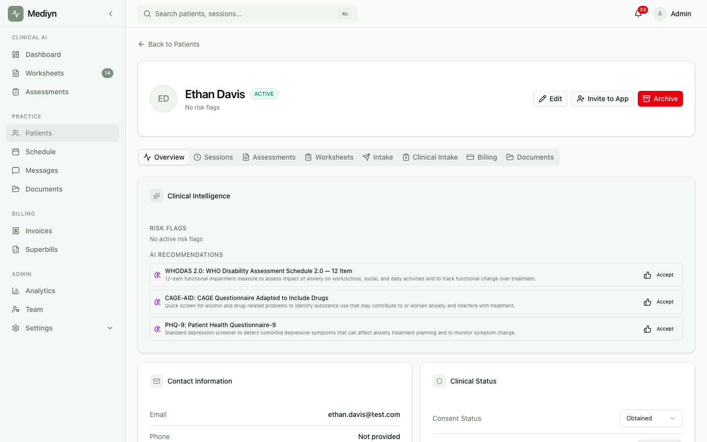

# How to Manage Patient Assignments

Assign one or more therapists to a patient in Mediyn so the right clinicians have access to the right records.

## Steps

1. Sign in to your Mediyn clinic admin account.
2. Navigate to the **Patients** section.
3. Open the patient record you want to update.
4. Go to the **Assignments** or **Therapist Assignment** area.
5. You'll need to provide:
   - **Therapists** — Select one or more therapists from your clinic to assign to this patient.
6. Save the assignments.

## What to Expect

- The patient is linked to the selected therapists.
- Assigned therapists can view and manage this patient's record.
- Previous assignments are replaced with the new list. If you want to add a therapist, include all current therapists plus the new one.

## Good to Know

- Only clinic administrators can manage patient assignments.
- You cannot assign the same therapist twice to one patient.
- All selected therapists must belong to your clinic.
- When a patient is created through a booking, the primary therapist is assigned automatically.
- Therapists can only access patients assigned to them. Updating assignments controls who can see what.
