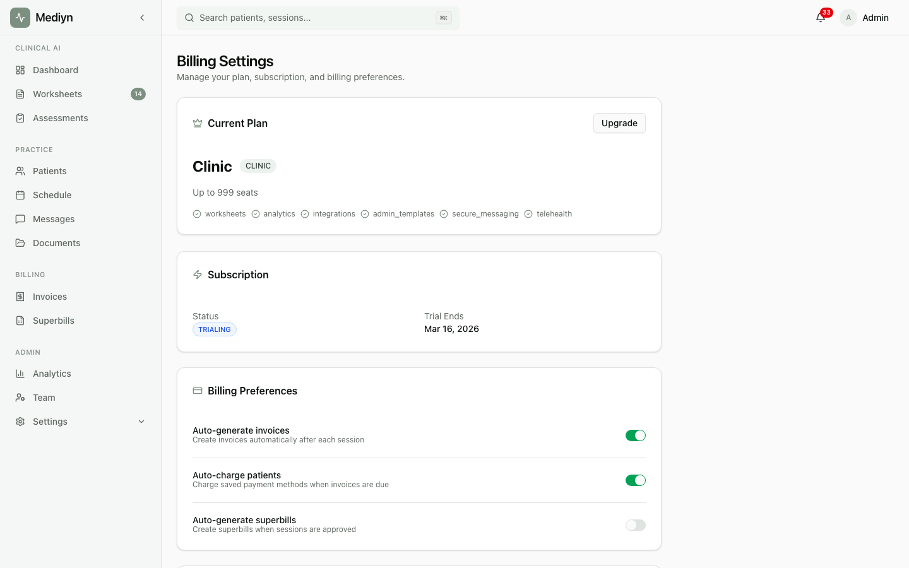

# How to View Available Plans

You can browse all Mediyn subscription plans to find the right one for your practice.

## Steps

1. Go to the Mediyn pricing page. You do not need to be signed in to view plans.
2. Review the list of available plans. Each plan shows its features and pricing.
3. Compare plans side by side to see which one fits your needs.

## What to Expect

You will see all available plans with their details. Plans are designed for different practice sizes, from solo therapists to multi-therapist clinics. Each plan lists its included features and monthly or annual pricing.

## Good to Know

- The pricing page is public. Anyone can view available plans without creating an account.
- Plan availability may change over time as Mediyn adds new options.
- If you already have a subscription, you can still view the pricing page to see if a different plan would be a better fit.
