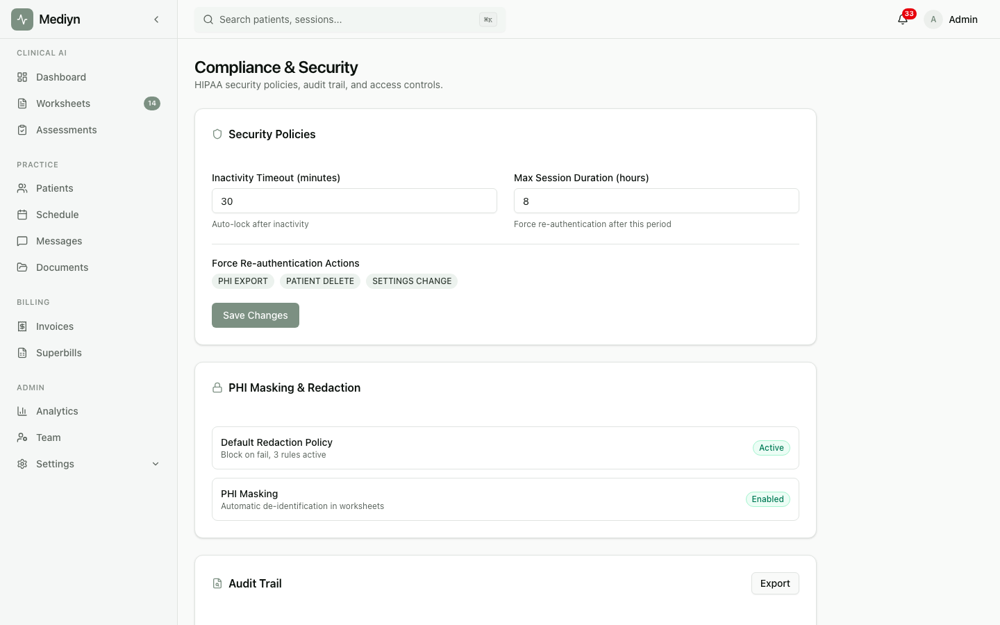

# How to Manage Access Recertification

Mediyn supports periodic access reviews so administrators can verify that every team member has the right level of access to patient data.

## What Is Access Recertification?

Access recertification is a scheduled review process. Administrators confirm that each person who has access to your practice's data still needs that access. This helps prevent unauthorized access over time as roles and team membership change.

## Viewing Recertification Campaigns

1. Go to **Settings** or **Compliance** in Mediyn.
2. Select **Access Recertification**.
3. You will see a list of all recertification campaigns, including past and current ones.

## Starting a New Recertification Campaign

1. Go to the **Access Recertification** section.
2. Select **Start New Campaign**.
3. Fill in the details.
4. Save and launch the campaign.

## You'll Need to Provide

- **Campaign name** — A descriptive name for this review (for example, "Q1 2026 Access Review")
- **Due date** — The deadline for completing the review

## What to Expect

After starting a campaign, administrators review each team member's access and confirm it is still appropriate. The campaign tracks progress toward the due date.

## Managing Consent Indicators

Mediyn also tracks consent status at the session level. You can update a session's consent status to reflect the current state of patient consent.

Available choices:
- **Pending** — Consent has not yet been addressed
- **Confirmed** — Consent has been confirmed by the patient
- **Obtained** — Consent has been formally obtained and documented
- **Revoked** — The patient has withdrawn their consent

To update consent status:
1. Open the session.
2. Go to the **Consent** section.
3. Select the appropriate status.
4. Save your changes.

## Good to Know

- Access recertification is a best practice for HIPAA compliance.
- Run recertification campaigns at least quarterly for practices with changing staff.
- Keep campaign names descriptive so you can easily find past reviews.
- Consent updates are recorded in the audit trail for compliance purposes.
- Only clinic administrators can start and manage recertification campaigns.
