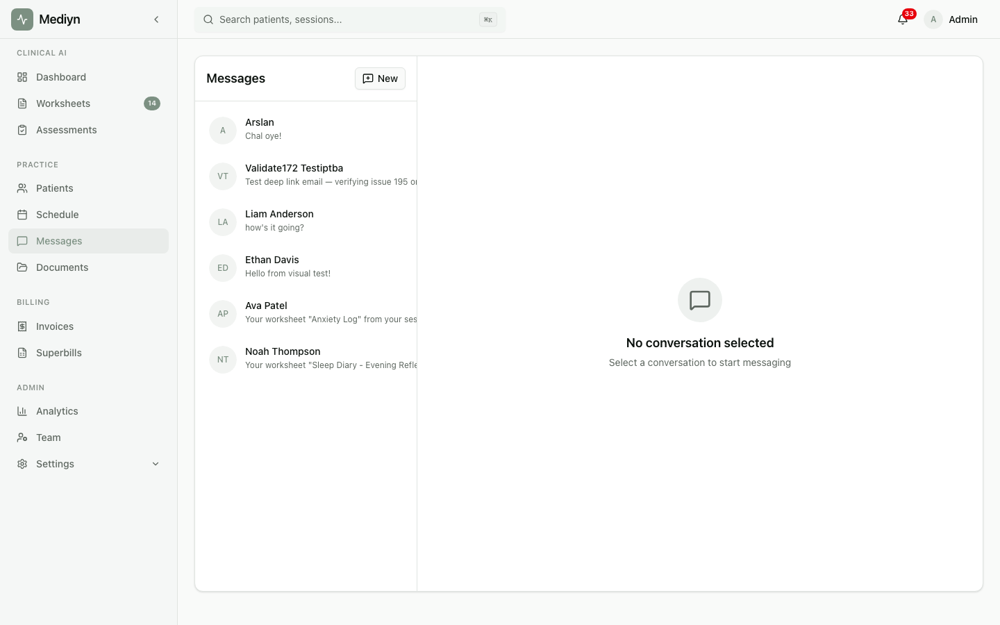

# How to Send and Receive Messages

Mediyn makes it easy to communicate securely with your patients through text messages and document attachments.

## Sending a Message

1. Open the conversation with the patient you want to message.
2. Type your message.

You'll need to provide:
- **Message text** -- The content of your message

You can also:
- **Attach documents** -- Include one or more files you have already uploaded to Mediyn

3. Choose **Send**.

### What to Expect

- Your message appears in the conversation immediately.
- The patient is notified that they have a new message.
- If you attached documents, they appear alongside your message text.
- Messages you send are automatically marked as read for you.

## Reading Messages

1. Open the conversation to see all messages.
2. Messages are displayed in order, with the most recent at the bottom.

### What to Expect

- Each message shows who sent it, the message content, any attachments, and the date and time.
- Messages from you, the patient, and Mediyn (such as worksheet notifications) are clearly labeled.
- Unread messages are marked until you open them. Once viewed, they are marked as read.

## Attaching Documents

1. Before sending a message with an attachment, make sure the document is already uploaded to Mediyn (see the Files & Documents section).
2. When composing your message, select the documents you want to attach.
3. Send the message as usual.

### What to Expect

- The attached documents appear with the message.
- The recipient can view or download the attachments directly from the message.

## The Patient Experience

Patients can also send messages from their own account:

- They open their conversation list to see all threads with their therapists.
- They can read messages, view attachments, and reply with text or their own attachments.
- Their messages follow the same secure delivery process.

## Good to Know

- All messages are sent through Mediyn's secure platform. No information is transmitted through email or other unsecured channels.
- You can see the read status for each message, so you know whether the other person has viewed it.
- Document attachments are securely stored and scanned. Only documents that have passed security checks can be attached.
