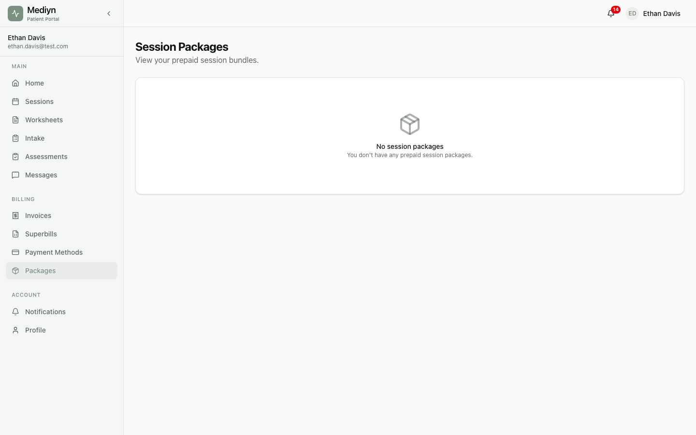

# How to Manage Session Packages

Mediyn makes it easy to view, track, and manage your patients' prepaid session packages.

## Viewing All Packages for a Patient

1. Open the patient's profile in Mediyn.
2. Go to the **Session Packages** section.
3. You will see a list of all packages for that patient.

You can also narrow down the list by status:
- **Pending** — Packages awaiting payment confirmation
- **Active** — Packages with sessions still available
- **Exhausted** — Packages where all sessions have been used
- **Refunded** — Packages that were refunded
- **Expired** — Packages past their validity period

## Viewing Package Details

1. Select any package from the list.
2. You will see the full details, including:
   - Session type
   - Total sessions purchased
   - Remaining sessions
   - Total price and currency
   - Current status
   - Date created

## Tracking Session Usage

Each package shows the number of remaining sessions. As the patient attends sessions, this count decreases automatically. When all sessions are used, the package moves to the **Exhausted** stage.

## Issuing a Refund

If a patient needs a refund for unused sessions:

1. Open the package details.
2. Select **Refund Package**.
3. Mediyn will calculate a prorated refund based on the remaining unused sessions.
4. The refund is processed, and the package moves to the **Refunded** stage.

## What to Expect

After a refund, the package is no longer available for use. The refunded amount reflects only the unused portion of the package.

## Good to Know

- Only clinic administrators can issue refunds.
- Refunds are prorated automatically. You do not need to calculate the amount manually.
- Once a package is refunded, it cannot be reactivated.
- If you need to browse through a long list of packages, Mediyn lets you load more results page by page.
