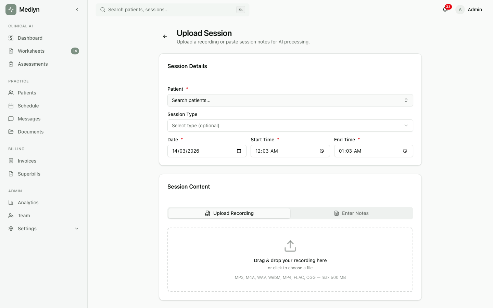

# Session Recording & Uploads

Mediyn handles session recordings and transcript uploads so your clinical notes can be generated automatically.

## What You Can Do

- Submit session transcripts and clinical artifacts after a session ends
- Upload encrypted recordings as a backup when on-device transcription is not available
- Attach external documents to a session
- Track the status of processing jobs
- Retry any processing that did not complete successfully

## Key Concepts

**Transcript Submission**
After a session, you submit the de-identified transcript to Mediyn. This is the primary way session content enters the platform. Mediyn can then generate clinical notes automatically, or you can include your own pre-generated notes.

**Clinical Artifacts**
The documents Mediyn produces from your session recording. These include the transcription, a session summary, and key insights. You can either let Mediyn generate these, or submit your own along with the transcript.

**Encrypted Recording Upload**
A fallback option for when on-device transcription is not available. You can upload an encrypted recording for processing. This is only accepted when no transcript already exists for the session.

**External Document**
Any non-recording file you want to attach to a session, such as a PDF or image.

**Processing Job**
When you submit a transcript or upload a recording, Mediyn creates a processing job. This job handles transcription, summarization, and insight generation. You can track the progress and retry if something goes wrong.

**Safe to Retry**
If you accidentally submit the same content twice, Mediyn recognizes the duplicate and returns the existing result. Your data will not be duplicated.
