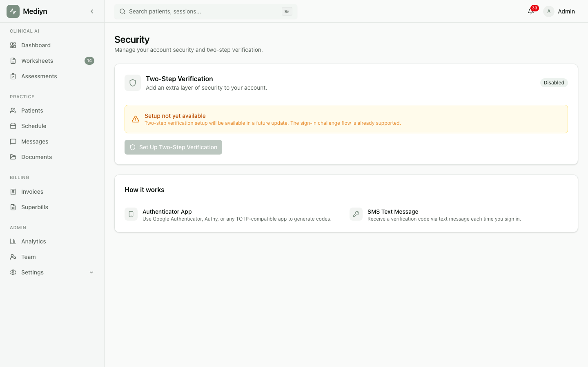

# How to Set Up Two-Step Verification

Two-step verification adds an extra layer of security when you sign in to Mediyn.

## Steps

1. Sign in to Mediyn with your email and password.
2. When prompted, choose your preferred verification method:
   - **Authenticator app** — Use an app like Google Authenticator or Authy to generate a time-based code.
   - **Text message** — Receive a one-time code via SMS to your registered phone number.
3. Enter the verification code you received.
4. Select **Verify** to complete sign-in.

## What to Expect

- After entering your password, Mediyn sends or generates a verification code.
- The code has an expiration time. If it expires, you can request a new one.
- Once verified, you are signed in to your account.

## Good to Know

- You can request a new verification code if the first one expires or does not arrive.
- Each code can only be used once.
- If you have trouble with the authenticator app, try the text message option instead.
- Two-step verification protects your account even if someone learns your password.
