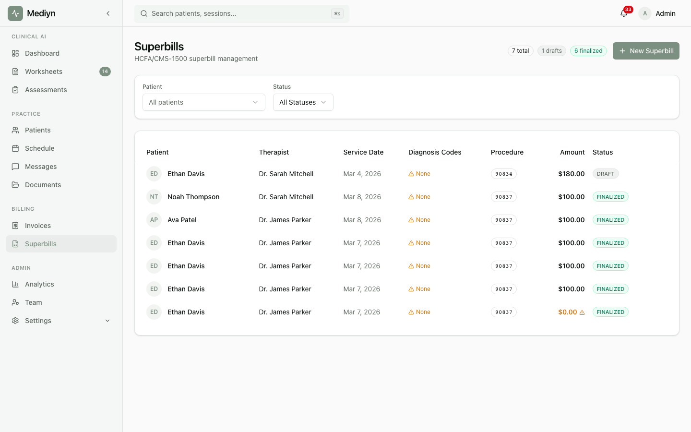

# How to Render and Download Superbill PDFs

Mediyn generates professional HCFA/CMS-1500 format PDFs that your patients can submit to their insurance company.

## Finalizing a Superbill

Before you can download a PDF, the superbill must be finalized.

1. Open the superbill you want to finalize.
2. Confirm that all details are correct (diagnosis codes, procedure code, patient and provider information).
3. Select **Finalize Superbill**.
4. Mediyn locks the superbill and generates a PDF.

Once finalized, the superbill can no longer be edited.

## Downloading the PDF

1. Open a finalized superbill.
2. Select **Download PDF**.
3. Mediyn provides a secure download link.
4. Save the PDF to your computer or share it with your patient.

## What to Expect

The PDF includes all the information required for an insurance claim:
- Provider name, NPI, and tax identification number
- Patient name, date of birth, and address
- Insurance details
- Diagnosis codes (ICD-10)
- Procedure code (CPT)
- Service date and amount
- Currency

## Good to Know

- Only finalized superbills have downloadable PDFs. Draft superbills must be finalized first.
- The download link is temporary and secured. Generate a new link if the previous one has expired.
- Both therapists and clinic administrators can finalize superbills and download PDFs.
- If you notice an error after finalizing, void the superbill and create a new one for the same session.
- Encourage patients to submit superbills to their insurer promptly. Many insurance plans have filing deadlines.
