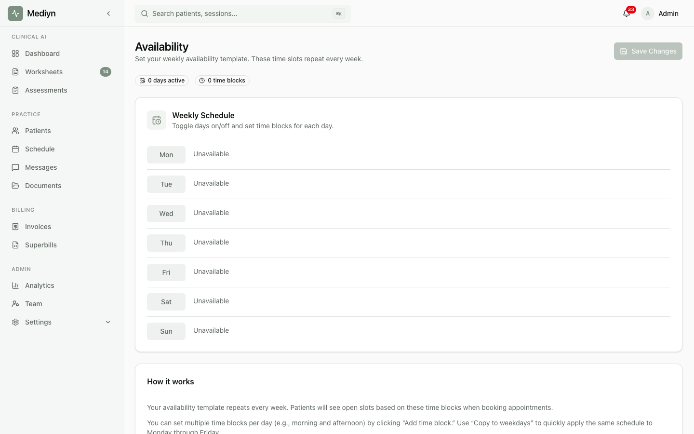

# How to Set Availability Templates

Define your recurring weekly schedule in Mediyn so patients and administrators know when you are available.

## Steps

1. Sign in to your Mediyn account.
2. Navigate to your profile or availability settings.
3. Select **Availability** or **Schedule Templates**.
4. Create or edit your weekly availability template.
5. Set the days and time blocks when you are available for appointments.
6. Save your template.

## What to Expect

- Your availability template tells Mediyn when you can be booked for appointments.
- The template repeats weekly, so you only need to set it up once.
- Scheduling features in Mediyn will use your template to show open time slots.

## Good to Know

- You can set up availability templates during onboarding or at any time from your profile settings.
- If your schedule changes temporarily, you can update your template and change it back later.
- Clinic administrators may set a default session duration for the clinic. Your personal session duration preference can override this for your own appointments.
- Your time zone setting affects how your availability is displayed. Make sure it is correct.
