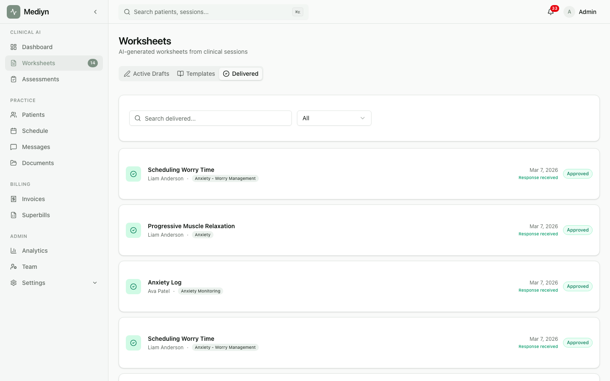

# How to Assign Worksheets to Patients

After approving a worksheet, you can assign it to a patient so they can complete it on their own.

## Assigning a Worksheet

1. Open the approved worksheet you want to share.
2. Choose **Assign to Patient**.

You'll need to provide:
- **Patient** -- The patient who will receive the worksheet

You can also:
- **Set a due date** -- Give the patient a deadline for completion

### What to Expect

- The patient receives the worksheet in their Mediyn account.
- The assignment starts in the **Assigned** stage.
- The worksheet moves through these stages as the patient works on it:
  - **Assigned** -- The patient has received it
  - **In Progress** -- The patient has started filling it out
  - **Submitted** -- The patient has completed and sent it back
  - **Reviewed** -- You have reviewed the patient's responses

## Tracking Patient Assignments

You can view all worksheet assignments for a specific patient.

- Open the patient's profile and look for their worksheet assignments.
- You can narrow down by status: assigned, in progress, submitted, or reviewed.

### What to Expect

- You see a list of all worksheets assigned to the patient.
- Each assignment shows its current stage, due date, and key dates (when it was assigned, started, submitted, and reviewed).

## Reviewing Patient Responses

1. When a patient submits a completed worksheet, you will be notified.
2. Open the submitted assignment to view their responses.
3. Mediyn shows the worksheet fields alongside the patient's answers.
4. Choose **Mark as Reviewed** to complete the review.

You can also:
- **Add review notes** -- Include your observations or feedback

### What to Expect

- You see the patient's responses organized by the worksheet's field structure.
- Once you mark the assignment as reviewed, it moves to the **Reviewed** stage.
- The review records who reviewed it and when.

## The Patient Experience

Patients can also view and complete their worksheets from their own account:

- They see a list of all worksheets assigned to them.
- They can open a worksheet to view the instructions and fill in their responses.
- They can save their progress and come back later, or submit when finished.
- Once submitted, you are notified and the responses are ready for your review.

## Good to Know

- Patients can save their work without submitting. Their responses are stored as in-progress until they finalize.
- When a patient submits, the assignment cannot be undone. They must complete all fields before submitting.
- You can view responses for any assignment linked to an approved worksheet, even if multiple patients were assigned the same one.
