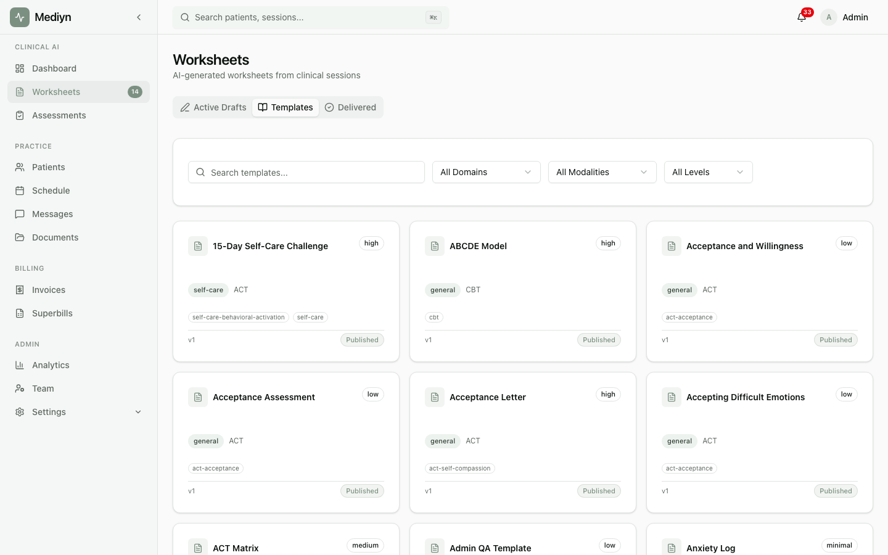

# How to Browse Worksheet Templates

Mediyn offers a catalog of worksheet templates so you can find the right fit for each patient and session.

## Steps

1. Open the **Worksheets** section in Mediyn.
2. Browse the template catalog. You can narrow down results using these options:
   - **Domain** -- Narrow down by therapy domain (e.g., cognitive behavioral, mindfulness)
   - **Modality** -- Narrow down by treatment modality
   - **Complexity** -- Narrow down by worksheet complexity level
   - **Status** -- Show only templates that are currently published, in draft, or retired
   - **Search** -- Type a keyword to find templates by name or topic
3. Select a template to view its details, including the fields it contains and a summary of its structure.

## What to Expect

- You will see a list of matching templates with their names, domains, and complexity levels.
- If there are many results, use the next page of results to see more.
- Each template includes a field summary so you know what information the worksheet collects.

## Good to Know

- Only **published** templates are available for creating new drafts. Draft and retired templates appear in the catalog for reference but cannot be used.
- If you are unsure which template to choose, try using the recommendation feature instead. Mediyn can suggest the best template based on your session notes.
