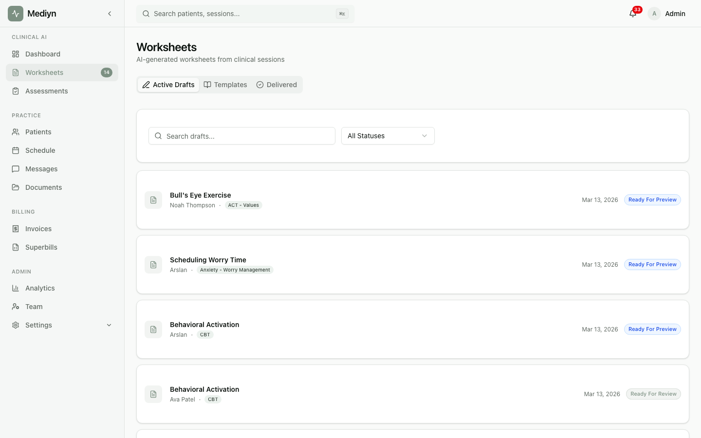

# How to Replace a Worksheet

If you need to update an approved worksheet, Mediyn lets you replace it with a new version while keeping a full audit trail.

## Steps

1. Open the session that contains the approved worksheet you want to replace.
2. Find the worksheet in the session's approved worksheets list.
3. Choose **Replace Worksheet**.

### What to Expect

- The original worksheet is marked as superseded.
- A new active worksheet takes its place.
- Both the original and the replacement are recorded for your records.
- Mediyn tracks which worksheet was replaced and which one is now active.

## Good to Know

- Replacing a worksheet does not delete the original. The previous version remains on file for audit and compliance purposes.
- You will see a clear record of the superseded worksheet and the new active version.
- Use this feature when clinical updates or corrections are needed after a worksheet has already been approved.
- If the patient has already been assigned the original worksheet and has started working on it, consider the timing before replacing.
